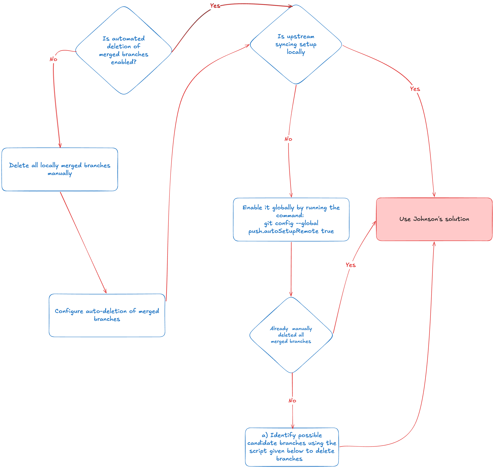

Software engineers will strive for the most minimal clean desk 🧹 setup while counterbalancing that with the linearly increasing ancient history 📈 of *merged remote branches* still existing on their local, like a showcase of their contributions.

👉 If you want to be rescued and *detangle that local git mess*, this miniblog should serve the purpose (thanks to my digital OCD triggers). 

Before starting, please run this command in your repository to find out how many local branches you are keeping (mine were 60 at the time of writing this article 🤫):

```bash
git branch | wc -l
```

## Cleanup based on GitHub workflows

A simple Google search gives you a multitude of articles that promise to cure your maladies once and for all.

*What is the catch you might ask?* 

All these solutions depend on the particular [GitHub merge workflows](https://docs.github.com/en/repositories/configuring-branches-and-merges-in-your-repository/configuring-pull-request-merges/about-merge-methods-on-github) used by you or your organization. We would be classifying our solution based on these workflows, and while different platforms (github, gitlab etc.) might expose them differently, they all work similarly under the hood.

<InfoQuote>
It is Recommended to read up on [upstream tracking](https://algomaster.io/learn/git/upstream-tracking) required for linking remote branch to local.
</InfoQuote>

| Name | Merge strategy | Upstream tracking | Remote deletion | Solution |
| --- | --- | --- | --- | --- |
| **Forbidden fruit** | Merge commit | ❌ | ❌ | There are a number of blogs which help with this since it is easiest to deal with but also rarely practically deployed workflow. [Rishabh’s blog](https://rrawat.com/notes/delete-merged-branches-git) that provides a concise solution |
| **Layman’s solution** | Squash merge/Rebase merge | ✅ | ✅ | [Johnson’s blog](https://adamj.eu/tech/2022/10/30/git-how-to-clean-up-squash-merged-branches/) is applicable in this case but only if both of the requirements are fulfilled. |

## Meeting halfway to a layman’s solution

Now, to reach a state in the codebase where the layman's solution is applicable, we want to perform some steps, and it depends on where you are in terms of your setup.



Hacky script (above Figure step a) to sync remote and local branches and output the ones not existing on remote (merged, deleted, and branches not yet pushed to remote). Furthermore, it gives the provision to the user to delete all the branches after reviewing the output. 
```bash
#!/usr/bin/env bash

set -uo pipefail

# Update remote references and remove deleted ones
git fetch --prune

branches=()
while IFS= read -r branch; do
  if ! git show-ref --quiet "refs/remotes/origin/$branch"; then
    branches+=("$branch")
  fi
done < <(git for-each-ref --format='%(refname:short)' refs/heads/)

if [[ ${#branches[@]} -eq 0 ]]; then
  echo "No local branches missing on origin."
  exit 0
fi

echo "Local branches missing on origin:"
echo "----------------------------------"
for branch in "${branches[@]}"; do
  echo "• $branch"
done
echo

read -r -p "Delete all ${#branches[@]} branch(es) listed above? [y/N] " confirm
if [[ ! "$confirm" =~ ^[yY]$ ]]; then
  echo "Aborted. No branches deleted."
  exit 0
fi

current_branch=$(git branch --show-current)
deleted=0
skipped=0

for branch in "${branches[@]}"; do
  if [[ "$branch" == "$current_branch" ]]; then
    echo "Skipping '$branch' (currently checked out)"
    skipped=$((skipped + 1))
    continue
  fi

  if git branch -D "$branch"; then
    deleted=$((deleted + 1))
  else
    echo "Failed to delete '$branch'"
    skipped=$((skipped + 1))
  fi
done

echo
echo "Done. Deleted: $deleted, skipped: $skipped"
```

Voila! You’ve streamlined a portion of your developer workflow, which can be a minor inconvenience or a huge pain in the ass.

---

## Footnotes

- [Merge commit workflow](https://rrawat.com/notes/delete-merged-branches-git) Rishabh’s blog talks about this workflow cleanup
- [Squash merge workflow](https://adamj.eu/tech/2022/10/30/git-how-to-clean-up-squash-merged-branches/) Johnson’s blog explains it and makes it waterproof as well
- [Github’s doc](https://docs.github.com/en/repositories/configuring-branches-and-merges-in-your-repository/configuring-pull-request-merges/about-merge-methods-on-github) Discussing various merge workflows available on the platform