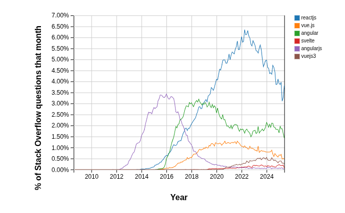
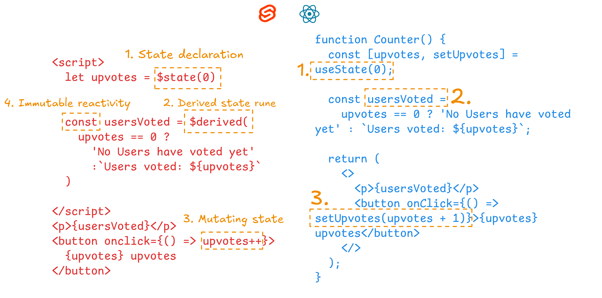
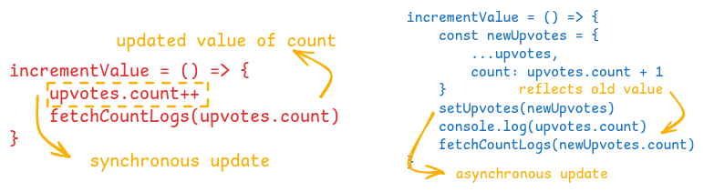
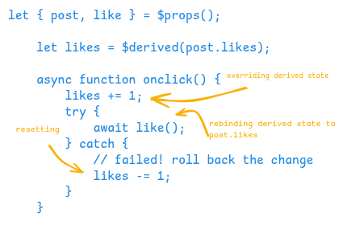
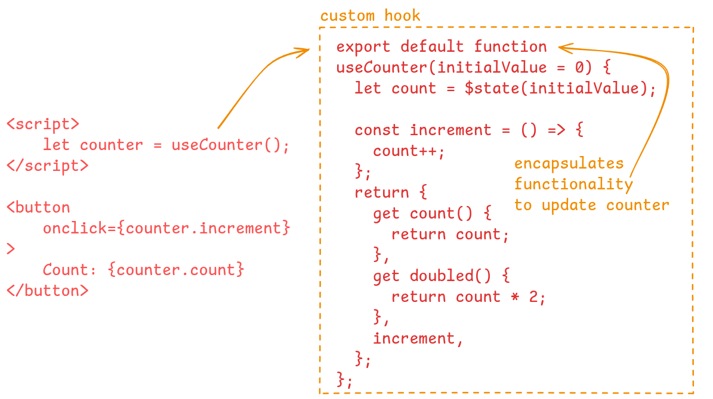

Are you a legacy React developer?

Have you heard of the chronicles of a once-mystical creature 👾 known as [class based components](https://react.dev/reference/react/Component) in React?

After spending so long exclusively in the React ecosystem — _with only brief forays into Vue.js and Angular_ — I almost feel confined, as if under house arrest. It's as if React has become a pandemic and developers its captive patients. Attempting to leave this ecosystem — which has admittedly served me well in terms of developer satisfaction and community standards reminiscent of Golang — feels like swimming against the current of [global popularity trends.](https://trends.stackoverflow.co/?tags=reactjs%2Cvue.js%2Cangular%2Csvelte%2Cangularjs%2Cvuejs3)



Wait, let's pause for a moment… we're drifting from the topic. This isn't an angry rant about why you should abandon React and sail off to svelte land—I'll save those opinions for another day. While I'm not a svelte advocate (having barely dipped my toes in it), there is some evidence in [svelte's blog](https://svelte.dev/blog/virtual-dom-is-pure-overhead) and a single [Hacker News thread](https://news.ycombinator.com/item?id=37586203) about the modest runtime performance benefits of svelte over React —though a 95% decrease in bundle size is nothing to laugh at.


The purpose of this article is to provide an exhaustive guide on the dos, don'ts, and gotchas of local component-level state management in svelte. I was recently influenced by [the yellow house](https://academypublisher.in/2024/10/07/the-yellow-house/) — while the column explores Van Gogh's artwork and its psychological implications — my takeaways from it gave me the notion ([also](https://www.notion.com/), the _editor of choice_ for writing this article) that drawing parallels from our experiences is the most effective way of learning and moving forward.


## Defining the scope

As much as I'd like to cover the intricacies of event handling, idiomatic design patterns, and dive into the internals of svelte, these topics are already well-documented in [svelte's docs](https://svelte.dev/docs) for those willing to take a deep dive. Instead, we'll focus our exploration on answering these key questions:

- How does state management work 💪 and what are runes?
- ❓ How does reactivity work?
- What causes dependencies of state to update?
- 🪝 How to make custom `react-like` hooks in svelte?

Let's get started 🚀

## Let’s Rune your day

Runes constitute the **primary tools** for **state management** in svelte. To quote from the [official svelte docs](https://svelte.dev/docs/svelte/what-are-runes):

> If you think of svelte as a language, runes are part of the syntax — they are keywords.

Our exploration will be limited to the following set of runes: `$state`, `$derived` and `$effect`. Starting with a snippet of code, we have the same functionality implemented in svelte and React. The annotations highlight the **1:1 mapping** between syntax in the two libraries (Even though svelte is a framework, we’ll refer to it as a library for the purposes of this article).


We’ll break down the code piece by piece to highlight the key differences and potential gotchas, so you’re not caught off guard at work.

<InfoQuote>
  Runes were introduced in `v5` — the latest major version at the time of writing this article. All
  state can be safely migrated to use runes, with the added benefit of improved performance. The
  official migration guide is available [here](https://svelte.dev/docs/svelte/v5-migration-guide).
</InfoQuote>

## State reactivity using proxies

In **Fig. 1**, we declare and initialize a local store using `$state(0)`. Under the hood, svelte sets up a **proxy** to enable reactivity. In simple terms, [proxy](https://developer.mozilla.org/en-US/docs/Web/JavaScript/Reference/Global_Objects/Proxy) intercepts any read or write operations on the state object. The state is consumed in a way that feels similar to React, although updating state in svelte often requires a slight mental shift to get used to.

In svelte, state is [mutable](https://developer.mozilla.org/en-US/docs/Glossary/Mutable), irrespective of it's value being a primitive or an object. This is demonstrated in **Fig. 1** (**Point 3)** using `upvotes++`. This mutation updates the state and triggers a UI re-render in the next animation frame — similar to React’s `setState(upvotes + 1)`.

Sweet! Let’s move on to other syntax features.

## Deprecating `$:` in favor of `$derived` & `$effect`

In svelte, any variables or functions defined **outside of runes** are declared and run exactly once when the **component is initialized**.

```js
const upvotes = $state({
  count: 0,
  completed: false,
});
let derivedDoubled = $derived(upvotes.count * 2);
let doubled = upvotes.count;

$effect(() => {
  let timeout = setInterval(() => {
    console.log(upvotes.count);
  });
  return () => clearInterval(timeout);
});
```

There are a [few points to note from the snippet](https://svelte.dev/playground/46af7389a13c4f70ad5c751cb1228715):

1. `$effect` — acts as a drop-in replacement for `useEffect`, with runtime fine-grained dependency tracking.
2. `derivedDoubled` uses `$derived` — it automatically updates based on variables referenced in the expression `upvotes.count * 2`. According to the svelte docs, it updates synchronously using _push-pull reactivity_, ensuring that any function accessing derived state receives consistent values in sync with its dependencies.
3. **`doubled`** — remains unchanged when `upvotes.count` updates, behaving similarly to React’s `useRef`.

<InfoQuote>
  ℹ️ Use [`derived.by(fn)`](https://svelte.dev/docs/svelte/$derived#$derived.by) for more complex
  logic instead of the shorthand `derived(expression)`.
</InfoQuote>

## Reactivity is fine-grained

```js
const upvotes = $state({
	count: 0,
	completed: false
})

$effect(() => {
	console.log(upvotes.completed ? `Voting has completed`: 'Voting not completed')
})

<button onclick={() => upvotes.count++}>
  clicks: {upvotes.count}
</button>
```

[In the example above](https://svelte.dev/playground/9f44e80e72f24e0baa2a8d9f798afc35), we’ve modified the upvotes `$state` from **number** to **object** . To follow :

1. We’re incrementing the `count` property.
2. Using `$effect` to log whether the voting has completed — similar to `useEffect` in react.

Since only `upvotes.completed` is consumed in the `$effect` block, it is not executed if `upvotes.count` is updated. This check is dynamically done at runtime, similar to useEffect. This is called `key` level granularity.

```jsx
useEffect(() => {
  console.log(upvotes.completed ? `Voting has completed` : 'Voting not completed');
}, [upvotes.completed]);
```

Key Takeaways:

1. `$effect` **observes the reactive signals** (`$state`, `$derived`, etc.) **while executing** its expression. That means dependencies are dynamically detected during the function call—not inferred during build.
2. **Prevent unncessary re-renders** — The child components consuming `upvotes.completed` will not be re-rendered due to shallow comparison of props.

React offers better visibility into reactive statement while svelte works for the user with
cleaner syntax and implicitly takes care of the dependencies.

<InfoQuote>
  ℹ️ Svelte optimizes away redundant assignments such as `upvotes.count = upvotes.count` or
  `upvotes.count += 0` will invalidate state updates.
</InfoQuote>

## Synchronous state updates

**Task** — We want to execute `fetchCountLogs` immediately on update of `upvotes.counts` . In React, we couldn’t directly use the next state due to asynchronous updates. Therefore, we are bound to create a new variable called `newUpvotes` which needs to be referenced everywhere if we were to use the updated value of `upvotes.count`.



svelte takes a different approach, decoupling state updates from batched DOM re-renders. This allows `fetchCountLogs` to run immediately after incrementing the value of `upvotes.count` , consuming the latest value of the state.

## Overriding immutable reactivity in `$derived`

Coming to the fourth point mentioned in **Fig. 1**, derived state is rarely mutated manually and therefore declared as a `const` in 99% of usecases. A rare case, mentioned in [svelte docs](https://svelte.dev/docs/svelte/$derived#Overriding-derived-values), displays the case of optimistic UI updates, where we want to override `$derived` manually, hence declaring it as `let`.



While it helps make the website feel snappy, it should be used in **rare instances** and in features which aren’t critical to write failures. **For Example**, liking a video on youtube can have optimistic updates, since the count is an estimate to begin with while commenting on the post could only be shown as sent when the server request is marked completed.

## An alternative to custom `react-like` hooks

By now, we already have all the tools required for creating custom hooks using `runes`. It’s a straightforward vanilla solution with an uncanny resemblance to react hooks syntax. I’ve implemented a `usePrevious` hook which tracks the previous value of the state variable using runes.



Working version for the above example is present [here](https://svelte.dev/playground/b21a77e18b314f2a85d2a28412ae9d8d). There’s a bunch of commonly used hooks implemented on this [website](https://userunes.com/explore) in both javascript & typescript . Happy hunting :)

<InfoQuote>
  It is worth noticing that `runes` can only be used in files with extension `svelte.{(ts, js)}` .
</InfoQuote>

## What lies ahead?

Despite having discussed exhaustively about the properties of component state management and reactivity, there’s certain topics necessary to make your life easier working with svelte:

1. Managing global state using svelte stores (next part in the series, hopefully)
2. Updating _parent state from child components_ leveraging `$props` & `$bindable`
3. **Bypassing deep reactivity** using `$state.raw` & `$state.snapshot`
4. Handling [direct DOM mutations](https://svelte.dev/playground/bee667bc01d44d4197322007febc3773) based on state updates using [tick](https://svelte.dev/docs/svelte/lifecycle-hooks#tick)
5. Resetting component and it’s state using [key blocks](https://svelte.dev/docs/svelte/key)

I hope this article helped you understand the basics of runes and state management—and instilled some confidence to support your journey toward becoming a **svelte wizard**.

Feel free to comment on what you liked, disliked or hated. Or reach out directly on [Twitter](https://x.com/_himanshuc3).

---

## Footnotes

- [Vladimir Klepov](https://thoughtspile.github.io/2023/04/22/svelte-state/) Highly recommend his deep dive into svelte reactivity
- [Svelte Docs](https://svelte.dev/docs) to get lost in the rabit hole of the framework
- [MDN Docs](https://developer.mozilla.org/en-US/docs/Web/JavaScript/Reference/Global_Objects/Proxy) It's more than just documentation
- [XKCD Comics](https://imgs.xkcd.com/comics/dependency.png) While [Empericism](https://xkcd.com/2855/) was more apt for the article, one of my favorites is a take on the fragile nature of proprietary projects
- [Shymanta D, Dyutimitra S.](https://academypublisher.in/2024/10/07/the-yellow-house/) The Yellow House is one of numerous psychological case studies, distinguished by its clean and concise presentation
- [UseRunes](https://userunes.com/) - Explore custom hooks
