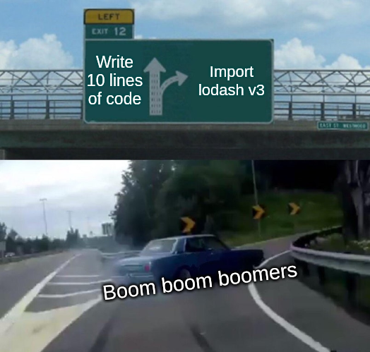

नमस्ते 	&middot; Hello &middot; Konnichiwa &middot; হেৰি &middot; สวัสดี &middot; مرحبًا &middot; Ni hao

Above are greetings in seven different languages: Hindi, English, Japanese, Assamese, Thai, Arabic and Malay, in order from left to right. I welcome you aboard to my little crapping digital space (r.i.p the luxury of physical space 🇮🇳).

> Fun Fact:  These are all the languages I’ve spoken in or national language of the places I’ve travelled to.

No, This is not an article on [localization](https://developer.mozilla.org/en-US/docs/Glossary/Internationalization). And yes, I did google most of the translations. Now while the introductory article is usually kept a way of testing the waters, I am going to throw caution to the wind, virtue of the solid average content[^1] at display from the get go.   

Hopefully this is the first of of many pieces of articles to follow up. I am not much into reading novels or the practice of regular writing, so I would like to apologize for any grammatical, structural or technical mistakes that are to follow. 

I have mostly worked in React professionally and dabbled a bit in Vue.js. To add to the sparsness of my technical expertise, I have rarely worked on backend or systems development. Therefore this blog will act as a medium of conveying my ongoing experiments including but not exhaustive of [svelte](https://svelte.dev/), [node.js](https://nodejs.org/en), [golang](https://go.dev/) from the perspective of a typical frontend soyboy.

Recently I've also been sucked into the rabbit hole of developer productivity (mostly thanks to theprimeagen) which wastes a lot of my time counterintuitively. And as much as I'd like to bash (in your face zsh) my keyboard everytime I have to hit a bunch of keystrokes for copying ten lines in vim, it just looks way cooler while sharing screen to let go of. So, you can expect to see me agonizing about my tooling journey in vim, ansible and more buzz words.

And as a filler between the technical musings, you would also see me write articles about the architecture, or rather the non-existence of it, in my surroundings supported by some crappy photography. 

Welcome to the blog fellow boomers 👶 

[^1]: Any ideas put forward henceworth can be cringe, distasteful and authoritarian, very much like a man in love. Take them with a grain of salt.
