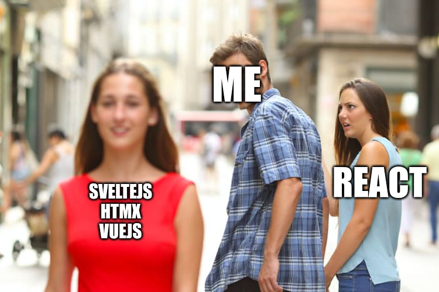

नमस्ते 	&middot; Hello &middot; Konnichiwa &middot; হেৰি &middot; สวัสดี &middot; مرحبًا &middot; Ni hao

Above are greetings in seven different languages: Hindi, English, Japanese, Assamese, Thai, Arabic and Malay, in order from left to right. I welcome you aboard to my little crapping digital space (r.i.p the luxury of physical space 🇮🇳).

> Fun Fact:  These are all the languages I’ve spoken in or national language of the places I’ve been to.

No, This is not an article on [localization](https://developer.mozilla.org/en-US/docs/Glossary/Internationalization). And yes, I did google most of the translations. Now while the introductory article is usually kept a way of testing the waters, I am going to throw caution to the wind, virtue of the solid average content[^1] at display from the get go.   

Hopefully this is the first of of many pieces of articles to follow up. I am not much into reading novels or the practice of regular writing, so I would like to apologize for any grammatical, structural or technical mistakes that are to follow. 

I have mostly worked in React professionally and dabbled a bit in Vue.js. To add to the sparsness, I have rarely worked on backend or systems development. Therefore the likes of svelte, node.js, golang could also be featured in the articles from the perspective of a frontend soyboy.

Recently theprimeagen[^2] has also edged in the direction of tooling and I’ve gotten spoilt into a world in which I feel very much like a foreign entity. So expect to hear my agonies on vim, ansible and so forth. 

[^1]: Any ideas put forward henceworth can be cringe, distasteful and authoritarian, very much like a man in love. Take them with a grain of salt.

[^2]: Thanks to overreacted taniarasia for inspiring me to create content the blog or copy over some key design ideas. 