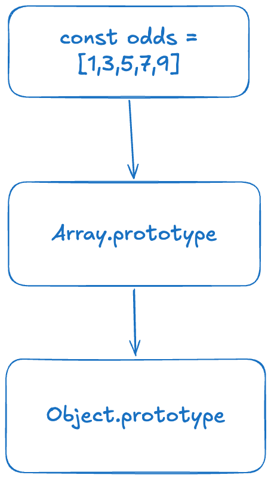

<InfoQuote>
TLDR: Don’t waste your time trying to master a language that resembles more like a khichdi than a carefully crafted plate of biryani.
</InfoQuote>

Okay, “hoax” is a bit dramatic.

JavaScript arrays *look like* the arrays you know from C, C++, Java, Go, Rust, and basically every language that convinced you an array is "a bunch of things sitting next to each other in memory."

Then JavaScript smiles politely and says, "Sure.”

I can’t begin to emphasize how Trump's tweets can still not fall close to the absurdities ingrained in the language by Mr. Brendan Eich in 10 days.

<blockquote class="twitter-tweet"><p lang="en" dir="ltr">&quot;We&#39;re going back to plastic straws.&quot; –President Donald J. Trump 🇺🇸 <a href="https://t.co/GONNjP6UNn">pic.twitter.com/GONNjP6UNn</a></p>&mdash; President Donald J. Trump (@POTUS) <a href="https://x.com/POTUS/status/1889090935071388109?ref_src=twsrc%5Etfw">February 10, 2025</a></blockquote> <script async src="https://platform.x.com/widgets.js" charset="utf-8"></script>

## Internal representation

This is a *quick side rant* into my ignorance of how the prototypal behavior in JS affects arrays, since they are a derivative of (for the lack of a better word, & I refuse to call it inheritance) an object. 



The diagram above represents the internal representation of every array (pronounced in Hindi) that is initialized in JS. It suffices to say the methods at disposal on `Array.prototype` makes mutation and computation with arrays very convenient. 

But to have the complete picture, we are going to discuss the quirks of arrays, which might help you save some time while debugging that gross production bug on a [friday ebening](https://www.youtube.com/watch?v=-sdiU97WU4c):  

🚫 **Linear memory** — While the answer is complicated to say the least and depends on a case-by-case basis, generally JS engines can do either linear or sparse memory allocation depending on how you use it.

💯 **Numbered indexes are a myth** — arrays only accept numbers as indexes, bananas are blue, and India is going to qualify for next FIFA World Cup. 

There is nothing preventing you from using an array as a hashmap/object. It’s a cute little way for taking revenge on your fellow colleagues in your code review.

🚨 **Out of bounds Exception** — The same leniency is followed with any value not present in the array returning undefined instead of throwing an error.

This philosophy is followed throughout the language, leading to unexpected runtime failures, which have been the cause of hours of unnecessary debugging. Therefore, it is generally better to use the methods provided by the array prototype.

```jsx
const arr = ['monday', 'tuesday']

// Numbered indexes are a myth
arr['funday'] = 'sunday'

// No out of bounds exception
console.log(arr[333], arr['😅']) // Output: undefined, undefined

// Hole in the wall
arr[333] = 'sanhakyusanjusan'
console.log(arr.length) // Output: 334

// Length is a suggestion
arr.length = 1
console.log(arr[1]) // Output: undefined
```

<InfoQuote>
To sum it up in a sentence, arrays are a special kind of object with access to certain methods.
</InfoQuote>

It would not be anything new if a senior frontend engineer could be as clueless as a fresher. Got any such absurd facts on your fingertips to share 💭