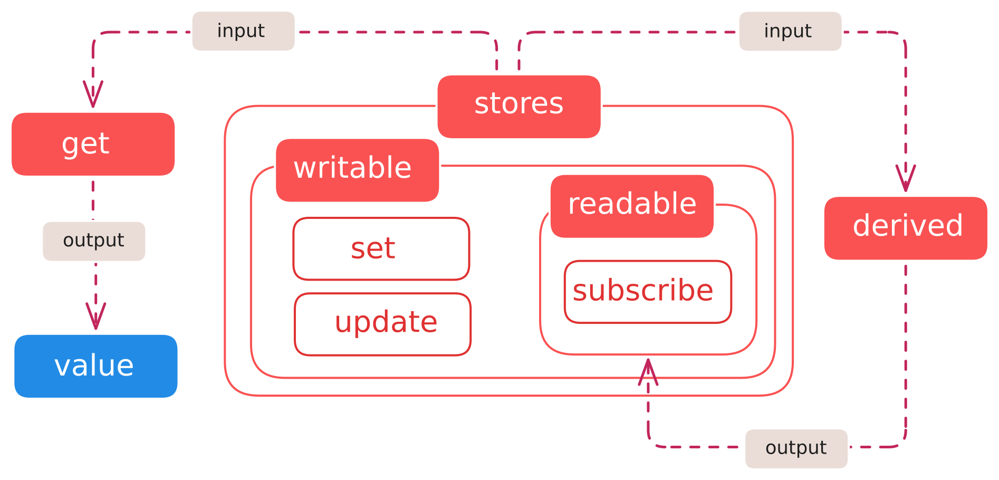
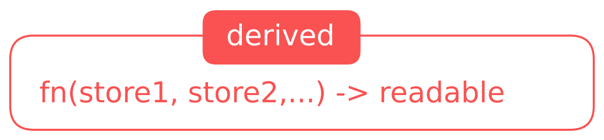
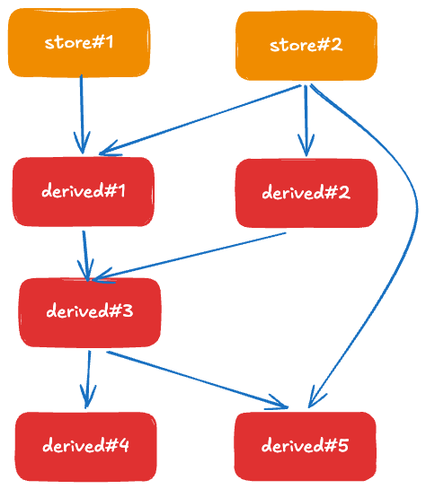

<InfoQuote>
The greatest enemy of knowledge is not ignorance; it is the illusion of knowledge ~ Stephen Hawking
</InfoQuote>

 

Ever since I’ve started working with Svelte as my primary tool of choice for all things frontend, I’ve had mixed emotions about managing application-level state. *On one hand*, it's incredibly easy to get started with; *on the other*, the APIs can feel frustratingly barebones—**offering little in the way of guardrails or recommended patterns.**

In the [previous blog post](https://www.himanshusb.in/blog/guide-svelte-state/), we took a deep dive into managing state at the component level. But let’s face it—unless you’re living in a world where 2 + 2 equals 3 (a true dystopia for mathematicians) or [animals extract milk from humans](https://en.wikipedia.org/wiki/Animal_Farm), you’re going to need a global state.

Something as simple as a theme toggle and as important as user authentication state are some common examples. While doing my research on the topic, I was still left with several questions unanswered:

- How are Svelte stores implemented under the hood?
- Is the reactivity model similar to that of runes?
- How can developers better encapsulate store logic?
- What performance considerations should we keep in mind when working with stores?

Before starting with the nuances of stores in Svelte, let’s brush up on our fundamentals.

## Fundamentals — Core Syntax

In Svelte, everything you need to manage state can be boiled down to just four keywords, all exposed via the `svelte/store` package: **writable**, **readable**, **derived**, and **get**.



1. **writable** This is the primary building block for stores. Roughly *93.14159265%* (a suspiciously precise metric—the digits after the decimal inspired by π) of your source-of-truth state will live inside writable stores.

2. **readable** The read-only counterpart to `writable`. It’s self-contained and designed for one purpose: subscribing to events. If you don’t need to react to updates, you might as well just use constants instead.

3. **derived** This is also a form of `readable` state. As the name suggests, it is derived from “writable/readables” and works similarly to `$derived` in runes.

4. **get** A simple utility function to retrieve the current value from any store synchronously.

<InfoQuote>
**Note:** There is also a `readonly` API within the `svelte/store` package at the time of writing. We’ll cover it briefly later, as it’s essentially a helper that wraps a `writable` store and exposes it as `readable`.
</InfoQuote>

## The Engine—observable pattern

The reactivity using Svelte stores is based on the [observer pattern](https://refactoring.guru/design-patterns/observer) (or pub-sub model), with the implementation spanning just a [single file](https://github.com/sveltejs/svelte/blob/main/packages/svelte/src/store/shared/index.js) in exactly 200 lines of code ✨. Svelte provides special `$` prefix syntax for auto subscription and unsubscription of stores from Svelte components, parsed by the compiler.

```jsx
// clicks_store.js
import { writable } from 'svelte/store'
export const clicks = writable(0)

// main.svelte
import { clicks } from './clicks_store.js'
<button onclick={() => $clicks += 1}>
	clicks: {$clicks}
</button>
```

In the above example:

1. Accessing the clicks store using $clicks automatically creates a subscription to the store on component mount and removes the subscription on destroy. 
2. The re-renders happen only when state is read in script `$:{console.log($count)}` or reading store value in DOM in `line 10`. **Updates or setting a value in a Svelte component are magically ignored by the Svelte compiler.** 

## Subscribing to store vs `get` API

Sticking to the previous example, now we want to read the value of `clicks` defined as a writable store. In Svelte components, we usually want the latest value of the store so that the UI is a function of the state. Therefore, we either subscribe to the source store or a readable coercion of it.

The second case involves reading values and performing some calculations on them in a utility function—hence the aptly named🥁 `derived stores` 🥁. Derived is a cousin to readable store, which can be represented as



Let’s discuss a simple example where we want to square the value of clicks. This can be completed in two ways:

```jsx
// 1. derived store - Setting up a reactive readable store
// Subscribing to clicks store making derived stores reactive
const squaredClicks = derived(clicks, ($clicks) => Math.pow($clicks, 2))

// 2. A JS utility function which is non reactive and synchronous
function nextMilestone(){
  // Auto subscribing and unsubscribing to any store using get() - like a getter
	const squaredClicksValue = get(squaredClicks)
	
	return squaredClicksValue % 2 ? squaredClicksValue + 1: squaredClicksValue
}
```

## Safe encapsulation of stores

Custom stores are just a layer of encapsulation over Svelte stores, providing flexibility in dealing with consuming stores while exposing only the required functionality. Consider the initial example of updating clicks, rewritten to provide clear separation of concerns:

```jsx
function createLikesStore(initialValue){
	const { subscribe, update, set } = writable(initialValue)
	
	return {
		// 1. Mandatory for reactivity in svelte components
		subscribe, 
		
		// 2. API exposed from store instead of a generic update and set utility
		incrementLikes: () => update(n => n + 1),
		decrementLikes: () => update(n => n - 1),
		reset: () => set(0),
	} 
} 

const likes = createLikesStore(3)
```

This simple wrapper over writable stores helps us add atomicity to svelte stores:

1. `Subscribe` helps us get the value inside Svelte components and utility functions using the `get` API. 
2. Notice that instead of exposing the generic set of `update` and `set` APIs, we expose functionality specific to our store to clearly define the use of the store. This makes bugs easier to debug, and maintainability of code is drastically improved.

## Deep-derived chains for reactivity

Derived stores aggregate multiple stores (readable/writable) as input to generate an output that is reactive. Klepov’s articles mention lazy-derived stores deferring the computation till the point they have at least one subscriber.

While they offer a legit use case to compute reactive values and reuse it across multiple components, the level of nesting can often go unnoticed. 



**Problem. Calculate value of** `derived #5.` 

**Solution.** Blue arrows show all the intermediate states that would need to be calculated in to get the result of `derived. 5`. So even though the explicit dependencies are `derived#3` and `store#2`, we would also need to recompute `derived#1` and `derived#2`. 

This can lead to an unwanted increase in compute cycles in derived store chains and is a **very common problem in large-scale applications.** Infact, 

## Fast updates block the main thread

When modeling state, two primary points need to be designed for:

- **Isolation based on semantics** Creating different stores for individual entities like user preferences and notifications
- **Performance** Since UIs nowadays are a function of state, we need to ensure users have a smooth user experience while keeping an updated state.

When we discussed Svelte stores using an observable pattern, we missed a key point. These are synchronous updates. This is a key observation because it leads to a violation of the second point. While most UIs don’t need to handle this amount of complexity (the tale of unlimited dashboards), applications using real-time data like canvas-based games or WebSocket handling (assume 1000 people editing the same Google doc, though certainly contrived and an obscure use case) need to handle the backpressure by either throttling the message queue or the state updates.

Consider the following snippet:

```jsx
  window.addEventListener('mousemove', (e) => {
  x.set(e.clientX);
  y.set(e.clientY);
  hoveredItems.set(getHoveredItems(e)); // expensive
});
```

Now since the handler can cause rapid state updates (potentially 100+ events/sec) leading to page jank and suboptimal UX, we have a few solutions to solve this use case:

- **Use `requestAnimationFrame`** for batching updates per frame
- Throttle store updates
- Maintain processing queue, if no updates can be skipped

 

Svelte store APIs, while seemingly playful on the surface level, provide exhaustive functionality for state management. The nuances mentioned here help avoid some common pitfalls while aiding with better store design. Thanks for making it this far, and stay tuned for strictly non-AI-driven content.

---

## Footnotes

- [Readonly API](https://svelte.dev/docs/svelte/svelte-store#readonly) Writable to readable explicit coercion 
- [Will Willems](https://willwillems.com/posts/store-design-in-svelte.html) Designing stores for better maintenance
- [Vladimir Klespov](https://thoughtspile.github.io/2023/04/22/svelte-stores/) Introduction to svelte stores
- [Svelte playground](https://svelte.dev/playground/hello-world?version=5.36.10) Your experimentation sandbox
- [Svelte Docs](https://svelte.dev/docs)